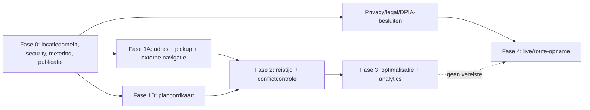

# Releasefasering

## Uitgangspunt

NXTDRIVE begint niet op nul:

- de browserclient laadt Maps JavaScript en de libraries `places`, `maps`, `marker` en `core` centraal in `artifacts/nxtdrive/lib/maps/loader.ts:81-147`;
- `artifacts/nxtdrive/components/places-autocomplete.tsx:52-79` gebruikt het bestaande `google.maps.places.Autocomplete`-widgetcontract;
- `artifacts/nxtdrive/lib/trial-lessons/route.ts:131-200` roept Compute Route Matrix server-side aan met een minimale field mask, timeout en Haversine-fallback;
- meerdere tabellen bewaren al vrije tekst, coördinaten en Place IDs, maar niet via één locatiedomein;
- de huidige planning is nog over meerdere schrijfgrenzen verdeeld, zoals gedocumenteerd in `docs/PLANNING_CORE_DISCOVERY.md`.

De juiste fasering is daarom: eerst consolideren en beveiligen, daarna productwaarde verbreden. Een nieuwe kaart mag geen tweede parallel locatiecontract introduceren.

## Fase 0 — Foundation en beheersing

Doel: één veilig en meetbaar fundament, zonder brede gebruikersactivatie.

### Scope

- MAP-01 centrale providerneutrale locatie-entiteit en typed relaties.
- MAP-04 gecontroleerde geocoding/backfillinterface, nog zonder bulkproductierun.
- MAP-05 opslag- en refreshbeleid voor Place IDs.
- MAP-09 dun providercontract, tenantmetering, entitlements, quota en circuit breaker.
- MAP-16 publicatie- en zichtbaarheidsgrens.
- MAP-26 offline-projectie van alleen eigen gepubliceerde stops.
- MAP-33 centrale Route Matrix-gateway; bestaande proeflescode wordt consument in plaats van afzonderlijke providerclient.
- MAP-47 technische privacycontrols vóór eventuele mobiliteitsdata.
- Aparte Cloudprojecten of ten minste gescheiden staging/productiecredentials; browser-, Android- en servercredentials zijn afzonderlijk beperkt.
- SKU-dashboard, budgets, quota-alerts, logredactie en operationele runbook.
- Migratiepreview, dubbele-schrijf-/adapterstrategie en rollback zonder destructieve datamigratie.

### Releasegate

- Iedere providercall heeft tenant, use-case, SKU/feature, latency, status en kostencategorie, maar geen volledig leerlingadres in logvelden.
- Geen universele onbeperkte API-key.
- RLS/authorisatietests bewijzen dat een gebruiker geen locatie van een andere tenant of niet-zichtbare afspraak kan ophalen.
- Bestaande vrije-tekstflows blijven werken wanneer Google ontbreekt, quota bereikt is of de provider faalt.
- Product owner, security owner en privacy owner keuren respectievelijk scope, keyarchitectuur en dataclassificatie goed.

### Rollback

Feature flags schakelen providerfuncties per tenant/use-case uit. Bestaande tekstvelden en routefallback blijven leesbaar. Nieuwe `location_id`-relaties zijn eerst nullable en worden niet als enige bron verplicht voordat reconciliatie compleet is.

## Fase 1A — Adressen en operationele basis

Doel: direct minder invoerfouten en sneller navigeren, zonder complexe optimalisatie.

### Aanbevolen MVP

- MAP-02 Autocomplete (New) met sessietokens en minimale velden.
- MAP-06 handmatige correctie en bron/validatiestatus.
- MAP-10 standaard ophaalpunt, los van woonadres.
- MAP-13 afwijkend ophaal-/afzetpunt per les met snapshot/publicatiegedrag.
- MAP-15 kaartpreview van alleen de gepubliceerde eigen afspraak.
- MAP-20 volgende locatie in instructeursapp.
- MAP-21 openen in externe Google Maps; geen interne navigatie.
- MAP-39 datakwaliteitslijst voor ontbrekende/ongeldige locaties.
- MAP-60 gecontroleerde CBR-locatiecatalogus.
- MAP-61 route naar bevestigde CBR-locatie.
- MAP-64 statische vertrek-/routeherinnering.

MAP-03 adresvalidatie en MAP-14 leerlingbevestiging starten alleen als begrensde pilot. MAP-07 importeert alleen via preview.

### Succesmetingen

- ≥95% van nieuwe operationele locaties krijgt een locatie-ID of expliciete `MANUALLY_CONFIRMED` status.
- Daling in afspraken met ontbrekend/ongeldig punt.
- Tijd om leerling of les met pickup te maken daalt zonder stijging van correcties.
- Navigatielink opent het juiste punt in een representatieve Android/web-testset.
- Autocomplete-sessies, details/validation-terminations en kosten per afgeronde locatie blijven binnen budget.

### Stopcriteria

- Een providerfout blokkeert de kernplanning.
- Providercontent wordt buiten toegestane velden/termijnen opgeslagen.
- Locaties lekken vóór publicatie of buiten rol-/tenantscope.
- Kosten per afgeronde locatie overschrijden gedurende twee meetperioden het ingestelde pilotbudget.

## Fase 1B — Dagkaart als planbordweergave

Doel: ruimtelijk inzicht toevoegen zonder planningmutaties los te trekken van het bestaande planbord.

Securitygate: de actuele Maps JavaScript strict-CSP-richtlijn gebruikt `unsafe-eval`, terwijl NXTDRIVE dit in een bestaande ADR verbiedt. Fase 1B is daarom een pilot na expliciete architectuurbeslissing. Voorkeur voor de PoC: een geïsoleerde maporigin zonder NXTDRIVE-sessiecookies en met geminimaliseerde markerpayload; geen globale CSP-verruiming. Zonder goedgekeurde optie blijft de lijst/tijdlijn plus externe navigatielink het productiepad.

### Scope

- MAP-31 kaartweergave/tab in `/backoffice/planning-board`.
- MAP-30 read-only dagkaartpilot met tijdlijn, filters, genummerde stops, selectie-sync en uitzonderingen.
- MAP-39 ontbrekende adressen en datakwaliteit zichtbaar op lijst én kaart.
- Alleen rechte/agenda-volgordelijnen in de eerste increment; geen automatische optimalisatie.
- Desktop split view, tablet kaart met uitschuifbare planning, mobiel aparte kaart-/lijsttabs.

### Waarom niet als algemeen dashboard

De kaart is een operationeel beslisinstrument met filters, selectie en acties. Een dashboardwidget mist ruimte en context; een los scherm dupliceert planbordstate. Het dashboard mag later maximaal een compacte uitzonderingswidget tonen die naar de planbordkaart deeplinkt.

### Releasegate

- Filters, selectie en toegangsbereik zijn identiek aan het planbord.
- Markerclustering/virtualisatie houdt de gekozen tenant- en daglimieten responsief.
- Een kaartload ontstaat alleen bij openen van de kaartweergave, niet bij iedere planbordrender.
- Zonder Maps blijft dezelfde planninglijst en alle mutaties werken.

## Fase 2 — Route-intelligentie in de centrale planningskernel

Doel: onhaalbare roosters voorkomen en plannerbeslissingen verbeteren.

### Aanbevolen scope

- MAP-25 verwachte reistijd, pilot met expliciete actualiteit/fallback.
- MAP-32 reistijdconflictcontrole in preview én server-side commit.
- MAP-33 Route Matrix als gedeelde gateway, voortbouwend op maar vervangend voor losse use-caseclients.
- MAP-34 beste-instructeurvoorstel op een vooraf hard gefilterde shortlist.
- MAP-50 werkgebiedkaartpilot.
- MAP-56 vraagdekking per grof postcodegebied.
- MAP-62 vertrekadvies voor examen met configureerbare buffer.
- MAP-24 traffic-aware berekening alleen rondom relevante legs, niet standaard overal.

### Beslissemantiek

1. Harde autorisatie-, beschikbaarheids-, branch-, voertuig- en capabilityregels filteren eerst.
2. Route Matrix berekent alleen de overgebleven relevante legs.
3. Een berekende route die niet past kan blokkeren volgens tenantbeleid.
4. Een geschatte of ontbrekende route geeft een zichtbare waarschuwing en vereist eventueel handmatige bevestiging; “onbekend” wordt nooit stil “haalbaar”.
5. De commit herhaalt kritieke validatie om een verouderde preview/race te ondervangen.
6. De planner ziet reden, alternatief en overridebeleid.

### Releasegate

- P95-latency, providerfoutpercentage en fallbackpercentage hebben vastgestelde SLO’s.
- Preview en commit leveren bij dezelfde versie van data dezelfde blockersemantiek.
- Kosten per geplande/mutated afspraak zijn per tenant zichtbaar.
- Geen matrix N×N over alle afspraken wanneer alleen buurlegs nodig zijn.

## Fase 3 — Begrensde optimalisatie en management

Doel: efficiëntie verbeteren nadat locatie- en kerneldata aantoonbaar betrouwbaar zijn.

### Scopevolgorde

1. MAP-42 handmatig oefengebied als kleine didactische pilot.
2. MAP-36 één-instructeurvolgorde voor ongepubliceerde/flexibele stops.
3. MAP-52/53 geaggregeerde lege-kilometer- en reistijdanalyse.
4. MAP-54 vestigingsanalyse en MAP-55 versieerbare zones, indien commercieel gewenst.
5. MAP-35 voertuig-/vestigingsvoorstel.
6. MAP-38 annuleringherstel als scenario, niet als automatische cascade.
7. MAP-37 multi-instructeuroptimalisatie pas na aantoonbaar succesvolle MAP-36-pilot.

### Premium-kandidaten

- routegebaseerde kandidaatvergelijking boven een inbegrepen maandvolume;
- optimalisatie (MAP-36–38);
- uitgebreide werkgebied- en efficiencyanalytics (MAP-50–55);
- traffic-aware actuele ETA op hoge frequentie.

Autocomplete voor kerndatakwaliteit, handmatige correctie, externe navigatielink en de basis datakwaliteitslijst horen niet uitsluitend achter een premiumslot als de tenant de locatiefunctionaliteit afneemt.

## Fase 4 — Privacygevoelige mobiliteit

Doel: alleen starten als een afzonderlijke businesscase de extra verwerking rechtvaardigt.

### Niet automatisch geactiveerd

- MAP-27 automatische aankomstdetectie;
- MAP-28 live locatie;
- MAP-40 routeopname;
- MAP-41 route terugkijken;
- MAP-43 route-afgeleide RIS-tags;
- MAP-44 oefenroutevoorstellen op bewegingsdata;
- MAP-45 variatieanalyse;
- MAP-51 exacte/geografische heatmaps.

### Verplichte voorafgaande besluiten

- scherp doel en noodzakelijkheid per functie;
- rollen, zichtbaarheid en buiten-werktijdgrens;
- juridische grondslag die niet automatisch op werknemerstoestemming leunt;
- DPIA-indicatie en zo nodig DPIA;
- OR/personeelsvertegenwoordiging en arbeidsrechtelijke beoordeling;
- korte bewaartermijn en technisch afdwingbare verwijdering;
- transparante UI-indicator, stopknop en audit;
- expliciet verbod op heimelijke individuele prestatiebeoordeling.

Zonder goedkeuring blijven de fase-0-controls voorbereid, maar wordt geen GPS-permissie gevraagd en geen bewegingsdata verzameld.

## Afgewezen in deze roadmap

- MAP-29 interne turn-by-turnnavigatie: externe navigatie levert de kernwaarde met aanzienlijk lager veiligheids-, support- en privacyrisico.
- MAP-46 toetsroutevoorbereiding: geen product bouwen rond vermeende CBR-examenroutes; algemene oefengebieden en navigatie naar de officiële locatie zijn voldoende.

## Samenvattende afhankelijkheden

